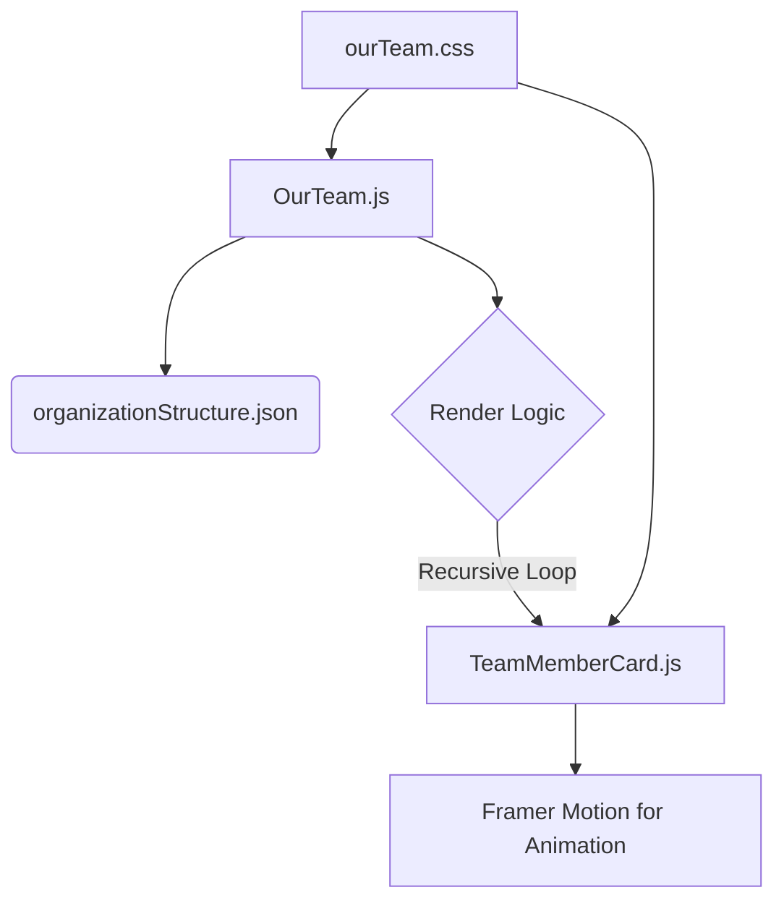

# Rencana Pengembangan Layout Struktur Organisasi IYSA

Berikut adalah rencana langkah-demi-langkah untuk membuat desain layout struktur organisasi yang modern dan animatif menggunakan React dan Framer Motion.

## 1. Instalasi Dependensi
- Menambahkan library `framer-motion` ke dalam proyek untuk menangani animasi.

## 2. Struktur Data
- Membuat file `src/data/team/organizationStructure.json` untuk menyimpan data hierarki tim. Ini memungkinkan pemisahan data dari logika tampilan.
- Setiap objek anggota akan memiliki properti seperti `id`, `name`, `position`, `photo1`, `photo2`, dan `children` (untuk anggota tim di bawahnya).

## 3. Komponen
- **`src/components/companyprofile/TeamMemberCard.js`**:
  - Komponen ini akan bertanggung jawab untuk menampilkan informasi satu anggota tim.
  - Menerima data anggota (nama, posisi, foto) sebagai `props`.
  - Mengimplementasikan efek `hover` menggunakan `motion` dari Framer Motion untuk mengganti dua foto.
  - Menambahkan animasi saat kartu pertama kali muncul di layar (misalnya, `initial`, `animate`).

- **`src/components/companyprofile/OurTeam.js`**:
  - File utama yang akan mengimpor data dari `organizationStructure.json`.
  - Mengatur layout utama dari struktur organisasi menggunakan CSS Flexbox atau Grid.
  - Membuat fungsi rekursif untuk me-render `TeamMemberCard` sesuai dengan hierarki (Owner -> General Manager -> ... -> Anggota Tim).
  - Menggunakan `motion.div` pada kontainer untuk mengatur animasi stagger (animasi berurutan) pada setiap kartu anggota tim.

## 4. Styling
- Membuat file CSS baru `src/css/companyprofile/ourTeam.css`.
- Mendesain kartu anggota tim agar terlihat modern dan simpel.
- Menambahkan style untuk garis-garis yang menghubungkan antar level jabatan dalam struktur organisasi untuk memperjelas hierarki.

## 5. Diagram Arsitektur Komponen

Setelah rencana ini disetujui, kita akan beralih ke mode "Code" untuk mulai mengimplementasikan solusi.
